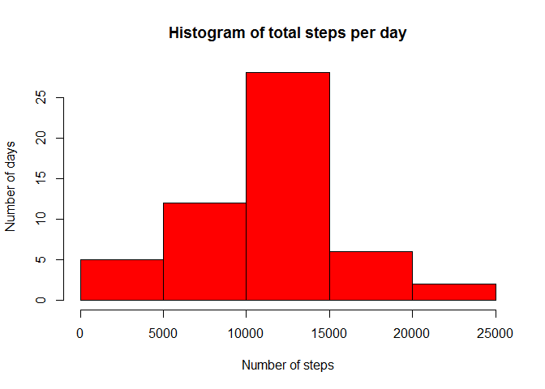
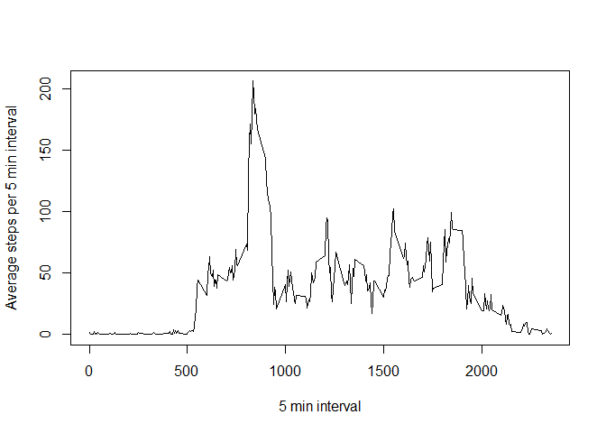
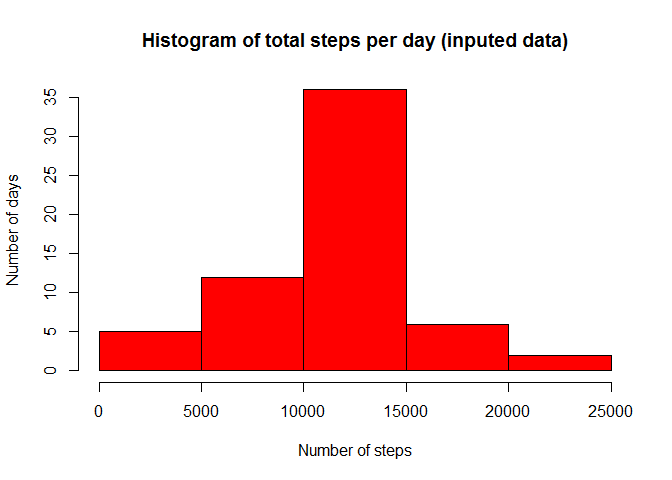
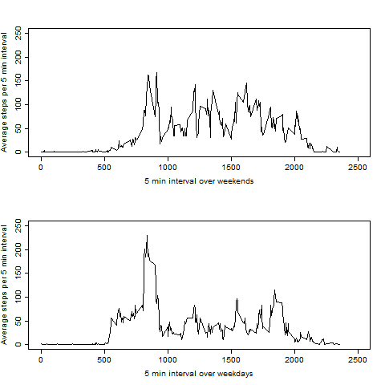

# Assignment1

Peer Assessment 1
=========================

## Loading and preprocessing the data

The database is stored in the link provided, <https://d396qusza40orc.cloudfront.net/repdata%2Fdata%2Factivity.zip>, which is a zip file with a csv file inside. Thus, downloading the file is a 3-step process: download it, unzip it and read it:

#### Downloading the file

```r
temp <- tempfile()
download.file("https://d396qusza40orc.cloudfront.net/repdata%2Fdata%2Factivity.zip", temp)
```

#### Unzipping and unlinking


```r
file<-unzip(temp)
unlink(temp)
```

#### Reading data, formatting the date and loading the data for it to Knit


```r
raw_data <- read.csv(file, header = TRUE, na.strings = "NA")
as.Date(raw_data$date, format = "%Y-%m-%d")
```

```r
load(file = "raw_data.RData")
```

The data base is named `raw_data`. The data then contains three variables, `steps` for the total number of steps, `date` for the date, and `interval` for 5 minute intervals within each day.


## What is mean total number of steps taken per day?

For this part of the assignment we first create a histogram of the total number of steps taken each day. First, the total number of steps per day is calculated as `tapply(raw_data$steps, raw_data$date, sum)`. Then the histogram is created using the preset number of class intervals. The histogram is formatted for it to have red columns and correct and intuitive labels.


```r
hist(tapply(raw_data$steps, raw_data$date, sum), col = "red", main = "Histogram of total steps per day", xlab = "Number of steps", ylab = "Number of days")
```

 

If we look at the data, we can see that there are several `NA` in the $steps$ variable.


```r
head(raw_data)
```

```
##   steps       date interval            datetime
## 1    NA 2012-10-01        0 2012-10-01 00:00:00
## 2    NA 2012-10-01        5 2012-10-01 00:05:00
## 3    NA 2012-10-01       10 2012-10-01 00:10:00
## 4    NA 2012-10-01       15 2012-10-01 00:15:00
## 5    NA 2012-10-01       20 2012-10-01 00:20:00
## 6    NA 2012-10-01       25 2012-10-01 00:25:00
```


Hence, to calculate the mean and the median we need to use the `na.rm = FALSE`. Using the same `tapply` trick we calculate the **Mean** and **Median**:


```r
mean(tapply(raw_data$steps, raw_data$date, sum, na.rm = TRUE))
```

```
## [1] 9354.23
```

```r
median(tapply(raw_data$steps, raw_data$date, sum, na.rm = TRUE))
```

```
## [1] 10395
```

## What is the average daily activity pattern?

To see the average daily activity we need to calculate the mean per 5-minute interval. That is achieved using `tapply(raw_data$steps, raw_data$interval, mean, na.rm = TRUE)`. That function produces the mean number of steps per interval. Those numbers are use to build the **time series plot of the 5-minute interval and the average number of steps taken:**


```r
plot(tapply(raw_data$interval, raw_data$interval, mean, na.rm = TRUE), tapply(raw_data$steps, raw_data$interval, mean, na.rm = TRUE), type = "l", ylab = "Average steps per 5 min interval", xlab = "5 min interval")
```

 

Notice that `tapply(raw_data$interval, raw_data$interval, mean, na.rm = TRUE)` was used as a trick to also obtain the intervals. To obtain the **5-minute interval that contains the maximum number of steps** we use the following sintax:


```r
which.max(tapply(raw_data$steps, raw_data$interval, mean, na.rm = TRUE))
```

```
## 835 
## 104
```

Notice that `which` is a correct approach in this case because the plot clearly shows the existence of just one maximum value. In this case, we just found out that the interval **from 8:35 to 8:40 is the interval with the largest number of steps on average**.


## Inputing missing values

We have already noticed the existence of several missing values and have worked around that. Now we are trying to input those values. First, we calculate **the total number of missing values in the dataset:**


```r
summary(raw_data)
```

```
##      steps                date          interval     
##  Min.   :  0.00   2012-10-01:  288   Min.   :   0.0  
##  1st Qu.:  0.00   2012-10-02:  288   1st Qu.: 588.8  
##  Median :  0.00   2012-10-03:  288   Median :1177.5  
##  Mean   : 37.38   2012-10-04:  288   Mean   :1177.5  
##  3rd Qu.: 12.00   2012-10-05:  288   3rd Qu.:1766.2  
##  Max.   :806.00   2012-10-06:  288   Max.   :2355.0  
##  NA's   :2304     (Other)   :15840                   
##     datetime                  
##  Min.   :2012-10-01 00:00:00  
##  1st Qu.:2012-10-16 05:58:45  
##  Median :2012-10-31 11:57:30  
##  Mean   :2012-10-31 12:23:58  
##  3rd Qu.:2012-11-15 17:56:15  
##  Max.   :2012-11-30 23:55:00  
## 
```

As the summary shows, **there are 2,304 missing values**.

We now **fill in all of the missing values as the mean for the corresponding 5-minute intevals**. We do so by using a *for* loop (I tried to use one of the apply functions but could not make it work). The **new dataset that is equal to the original dataset but with the missing data filled in is named *compdata* **:


```r
compdata <- raw_data
for(i in 1:17568){
  if(is.na(compdata[i,1])){
    compdata[i,1] <- mean(compdata[which(compdata$interval == compdata$interval[i]),1], na.rm = TRUE)}}
```

The **histogram of the total number of steps for the new database** is now shown:


```r
hist(tapply(compdata$steps, compdata$date, sum), col = "red", main = "Histogram of total steps per day (inputed data)", xlab = "Number of steps", ylab = "Number of days")
```

 

The new histogram shows a dataset that is more skewed towards the centre. We confirm that intuitive result with **the mean and median of the total number of steps taken per day:**


```r
mean(tapply(compdata$steps, compdata$date, sum))
```

```
## [1] 10766.19
```

```r
median(tapply(compdata$steps, compdata$date, sum))
```

```
## [1] 10766.19
```

**The impact of imputing missing data on the estimates of the total daily number of steps** in the way we did it is that both the mean and the median are now larger than they were in the original dataset.


## Are there differences in activity patterns between weekdays and weekends?

To answer to that questions we need to **create a new factor variable in the dataset with two levels, "weekday" and "weekend"**. We do so by instaling the `timeDate` package and using its `isWeekday` function to create the *weekday* variable:


```r
install.packages("timeDate")
library("timeDate", lib.loc="C:/Program Files/R/R-3.1.1/library")
compdata$weekday <- isWeekday(compdata$date)
```

The *weekday* variable was created as a binary variable: it is `TRUE` if the date is a weekday and false otherwise.

Finally, we create the **Panel plot containing a time series plot average across all weekday days and weekend days**. We create those plots using the basic plot features and the format presented in the README file.


```r
par(mfrow = c(2,1), cex = 0.6)

print(plot(xlim = c(0, 2500), ylim = c(0,250), tapply(compdata$interval[which(compdata$weekday == FALSE)], compdata$interval[which(compdata$weekday == FALSE)], mean, na.rm = TRUE), tapply(compdata$steps[which(compdata$weekday == FALSE)], compdata$interval[which(compdata$weekday == FALSE)], mean, na.rm = TRUE), type = "l", lty = 1, ylab = "Average steps per 5 min interval", xlab = "5 min interval over weekends"))

print(plot(xlim = c(0, 2500), ylim = c(0,250), tapply(compdata$interval[which(compdata$weekday == TRUE)], compdata$interval[which(compdata$weekday == TRUE)], mean, na.rm = TRUE), tapply(compdata$steps[which(compdata$weekday == TRUE)], compdata$interval[which(compdata$weekday == TRUE)], mean, na.rm = TRUE), type = "l", lty = 1, ylab = "Average steps per 5 min interval", xlab = "5 min interval over weekdays"))
```




The plot shows that around that during weekdays there is a larger average of steps taken in a 5 minute interval (of close to 250 steps), whereas during weekends there are several peaks present but none of them surpasses the 200 step mark. This might be an indication of rush-hour walking against pleasure walks taken during weekend.

*Thanks for visiting*
